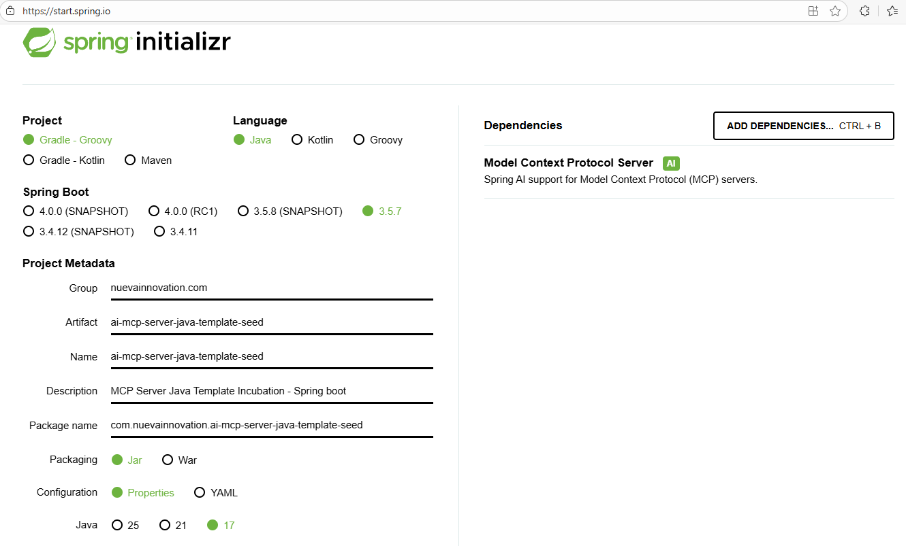
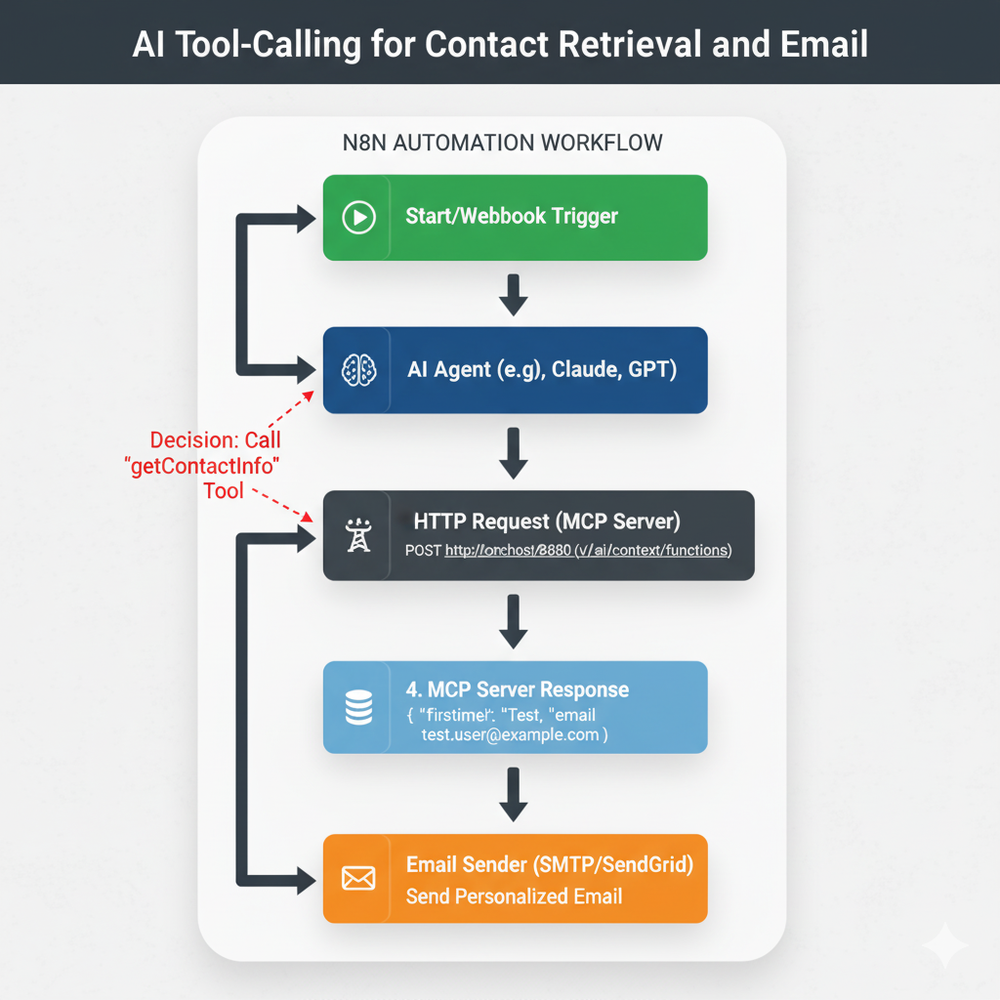

# ai-mcp-server-java-template-seed
MCP Server Java Template Incubation - Spring boot

### https://start.spring.io/



# 🚀 AI MCP Server Java Template Seed

This project is a Spring Boot application acting as an **AI Context Service** using the Spring AI MCP (Model Context Provider) pattern. It exposes two functions to retrieve contact and address information from a PostgreSQL database using JPA.

-----

## 📘 **Tutorial**

For a step-by-step guide on the concepts, setup, and testing of this MCP Server, please refer to the tutorial:

* **[MCP Server Setup and Usage Tutorial](docs/tutorial-mcp-server.md)
* **[MCP Server Setup and Usage Tutorial (TAGALOG) ](docs/tutorial-mcp-server-in-tagalog.md)
-----

## 📋 1. Tables Information

The application uses two primary tables to store customer data. These tables are managed by Spring Data JPA based on the `Contact` and `Address` entities.

| Table Name | Entity | Description | Key Fields |
| :--- | :--- | :--- | :--- |
| **`contacts`** | `Contact.java` | Stores primary contact details. | `contact_id` (PK), `email` (Unique) |
| **`addresses`** | `Address.java` | Stores physical address details, linked to a contact. | `address_id` (PK), `contact_id` (FK) |

### 🔍 AI Context Functions Provided

The `ContactContextService` exposes two functions to the AI model:

| Function Name | Description | Parameters | Purpose |
| :--- | :--- | :--- | :--- |
| `getContactInfo` | Retrieves contact details (name, email, phone) | `email` (String) | Contact Information Context |
| `getContactAddresses` | Retrieves addresses for a specific contact | `contactId` (Long) | Address Information Context |

-----

## 🛠️ 2. How to Setup Locally

### Prerequisites

* Java 17+
* Maven
* Docker and Docker Compose
* Postman (for API testing)

### Step 1: Set up the Database with Docker

1.  Ensure you have the `docker-compose.yaml` and `db_init_user_only.sql` files in your project root.

2.  Run the Docker Compose command to start the PostgreSQL container:

    ```bash
    docker-compose up -d
    ```

3.  The database will be running at `localhost:5432`. The application is configured to connect using the following credentials:

    * **URL:** `jdbc:postgresql://localhost:5432/ai_database`
    * **Username:** `[username]`
    * **Password:** `[password]`

### Step 2: Initialize the Database Schema and Data

1.  Connect to the running PostgreSQL container (e.g., using `psql` or a GUI tool).
2.  Run the `db_init.sql` script to create the `contacts` and `addresses` tables.
3.  The Spring Boot application, on startup, will use the `DatabaseSeeder.java` component to **automatically generate 1000 records** for both `contacts` and `addresses` tables, as requested.

-----

## ▶️ 3. How to Run

### Step 1: Build the Project

Use Maven to compile and package the application:

```bash
mvn clean install
```

### Step 2: Run the Spring Boot Application

Execute the packaged JAR file:

```bash
mvn spring-boot:run
# OR
# java -jar target/ai-mcp-server-java-template-seed-0.0.1-SNAPSHOT.jar
```

The application will start on port `8080`. The `DatabaseSeeder` will run, confirming the 1000 records have been created in the logs.

### Step 3: Test the Context Functions with Postman

1.  Import the provided `ai-mcp-context-postman.json` file into Postman.

2.  Use the imported requests to test the AI context functions:

    * **Test `getContactInfo`**:

        * **Request Body Example**: `{"name": "getContactInfo", "arguments": {"email": "user1@example.com"}}`
        * **Expected Result**: A JSON object with Contact details for `user1@example.com`.

    * **Test `getContactAddresses`**:

        * **Request Body Example**: `{"name": "getContactAddresses", "arguments": {"contactId": 1}}`
        * **Expected Result**: A JSON array of Address objects for the contact with ID `1`.

This confirms the service is correctly retrieving data from the PostgreSQL database and exposing it through the Spring AI MCP server endpoints.


## Enable Annotation Processing in your IDE

If your model classes use `@Data` (or similar Lombok annotations), you must enable annotation processing in your IDE so it can generate the methods before compilation.

### 🛠️ Fix for IntelliJ IDEA:

1.  Go to **Settings/Preferences**.
2.  Navigate to **Build, Execution, Deployment** -\> **Compiler** -\> **Annotation Processors**.
3.  Ensure the **"Enable annotation processing"** checkbox is **checked**.
4.  Apply the changes.

### 🛠️ Final Step: Rebuild Project

After enabling annotation processing and applying the settings, you must force the IDE to re-index the project:

1.  In IntelliJ IDEA, go to **File** -\> **Invalidate Caches...**
2.  Select **"Invalidate and Restart"**.
3.  Once the IDE restarts, perform a **Rebuild Project** (Build -\> Rebuild Project).

This process will force the IDE to run the Lombok processor, which will generate the missing methods and resolve all 17 "cannot find symbol" errors in `DatabaseSeeder.java`.


This workflow diagram illustrates how an **n8n automation** leverages an **AI agent** and the **MCP Server** to perform a customer outreach task.

## N8N Automation Workflow: AI Tool-Calling for Contact Retrieval and Email



The process flows linearly, where the **AI Agent** acts as the orchestrator, deciding when and how to call the external tool (the MCP Server) to fulfill its goal.

| # | n8n Node | Description |
| :---: | :--- | :--- |
| **1** | **Start/Webhook Trigger** | The workflow starts. This could be a new record in a database, a scheduling node, or a direct API call (Webhook). |
| **2** | **AI Agent (e.g., OpenAI, Anthropic)** | The AI receives a task (e.g., "Send a follow-up email to the contact with email address `test.user@example.com`"). It is pre-configured with the **MCP Server tool specification**. |
| **3** | **Tool Execution (Implicit/Decision)** | The AI decides the task requires calling the external `getContactInfo` tool. It generates the function call: `{"name": "getContactInfo", "arguments": {"email": "..."}}`. |
| **4** | **HTTP Request (MCP Server)** | An **HTTP Request Node** (or a dedicated n8n Spring AI node) is executed. It makes a `POST` request to the MCP Server endpoint: `http://localhost:8080/v1/ai/context/functions`. The body contains the tool call generated by the AI. |
| **5** | **MCP Server Response** | The MCP Server executes the underlying Java function (JPA query), retrieves the full name and phone number from PostgreSQL, and returns the JSON result to n8n. |
| **6** | **Function/Data Extraction** | An n8n **Code** or **Set** node processes the JSON response, isolating the required output variables (e.g., `firstName`, `lastName`, `email`). |
| **7** | **Email Sender (SMTP/SendGrid)** | The final node uses the extracted variables (`firstName`, `email`) to personalize and send the outgoing email. |